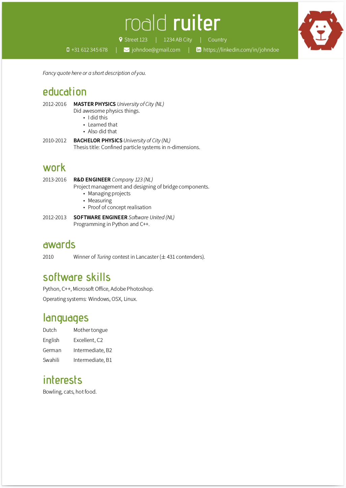

# CV template for XeLaTeX

This template lets you choose one base color via the `documentclass` option `changecolor`. You can for example use the color of the company you are applying for. By using a color harmony model, a color named `second` is picked. This color is only used for the links. However, if you choose the option `titlecolor=second`, the second color is also used for the titles. See the gif below for a little demo.

By choosing colors according to a color [harmony model](https://en.wikipedia.org/wiki/Harmony_\(color\)), you make sure the different colors match nicely. You can play around with different models [here](http://paletton.com/). For more information on how this template works, see the comments in `cv-roald-example.tex`.

# Changes in version 3
## Big changes
- Added a new `documentclass` option `colorharmony`, which defines a new color using color harmony models. The new color is called `second` and can be used in the document with `\color{second}`. This color is also used for the new `link{}` command, see below.
- Added a new `documentclass` option `titlecolor`, which allows you to set a different color for the titles.
- Defined a new command `\FAspace` which replaces the old length `\FAspace` (and therefore breaks compatibility with the v2 class file). Now you can use `\FAspace` directly in the document, instead of using `\hspace{\FAspace}`.
- Defined a new command `\link{someurl.com}`, which places a fontawesome logo in the document with the link. The color of the logo is detemined using the color harmony models.
- Removed the environment `tabitemize`, since the regular environment `itemize` also works. I don't remember why I implemented `tabitemize` in the first place.

## Small changes
- Reduced the indentation of a bulleted list

